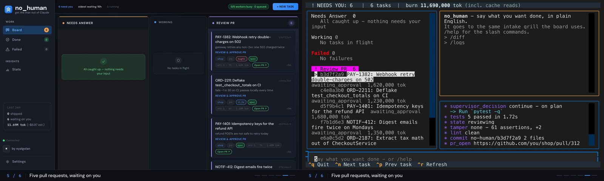

<div align="center">


# no_human

**Give it a ticket. Get back a pull request, with the evidence that it works.**

[](https://www.python.org/)
[](LICENSE)

[getnohuman.com](https://getnohuman.com) · [Quickstart](docs/quickstart.md) · [Docs](docs/README.md)

**[▶ Watch it work a sprint](https://getnohuman.com/#demo)**

</div>



Hand it a ticket and walk away. It plans, writes the change, has the work
reviewed by a second model that never saw it being written, runs your tests,
opens the pull request — and stops. You review and merge.

It runs on your machine, against your checkout, on your own Claude credential.
It is not, however, an offline tool: it sends your code to Anthropic as prompts,
and it finishes a task by **pushing your branch to your git host and opening a
pull request** — that is the deliverable, and there is no setting that turns it
off. The coder session also runs with an unrestricted tool set, so it can reach
the network on its own. The full list of what talks to the outside, what you can
switch off, and what you cannot:
[docs/security.md](docs/security.md#7-what-leaves-your-machine).

## Install

```bash
git clone <your-clone-url>/no_human.git && cd no_human
uv sync                 # installs the `nh` entry point into .venv
(cd web && npm install && npm run build)   # builds the board (cold first install can take minutes)
uv run nh init          # token, config, first repo (about 2 minutes)
uv run nh doctor        # verify the install is real before relying on it
```

The `web` build is not optional if you want the board pictured above: a source
checkout ships no `web/dist`, so without it `nh start` serves the API only and
renders no UI.

Needs Python 3.12+, [uv](https://github.com/astral-sh/uv), git, Node and npm
(for the board build above, and for the `claude` CLI), and a Claude
credential — an OAuth token from `claude setup-token` (personal subscription or
enterprise). To pay Anthropic directly instead, set `llm.auth_mode: "api_key"`
and put your `ANTHROPIC_API_KEY` in `~/.no_human/.env`.

## Run one task

Run `nh` with no arguments for the shell: your lanes, a live event tail, and an
intake you describe a task to in plain English. Every command below still works.

```bash
nh                                   # the shell
nh start                             # board + worker on 127.0.0.1:8420
nh task add https://github.com/org/repo/issues/42 --repo ~/git/repo
nh status                            # needs-you / working / waiting / done
nh review <id>                       # the reviewer's evidence checklist
nh diff <id>                         # the diff it wants to ship
nh approve <id>                      # records approval — you merge the PR
nh reject <id> --reason "..."        # send it back with feedback
```

## What you get

- **A plan before any code**, from the ticket plus what it finds in your repo.
- **An adversarial review.** A different model, fresh context, read-only tools,
  told to refute "done". You get a pass/fail checklist citing file and line —
  never a numeric self-score.
- **A tamper guard.** Deleted tests, new skips, an assertion turned into a
  tautology — blocked before a reviewer token is spent.
- **Proof the fix fixes something.** For a bug fix, the tests offered as evidence
  must fail at the merge base and pass on the new tree — the reproduction gate
  enforces that, and you can require it for every change.
- **Your tests run**, locally and optionally through your CI.
- **An honest stop.** When it cannot finish, it parks with one specific question
  instead of inventing a plausible diff.

## It waits for you to approve the PR

`gh pr merge`, `glab mr merge` and the REST equivalents are denied before they
execute. Pushes to `main`/`master`/`release/*` are refused at the git layer, and
no code path merges your PR on approval. Git is driven by no_human's own code
under a distinct commit identity, not by the model; during review the backend is
read-only. Credentials live in `~/.no_human/.env` (`chmod 600`), never in the
repo. Detail: [docs/security.md](docs/security.md).

Every task carries an enforced spend cap. `nh logs <id>` shows real spend
against it, per task.


## Docs

| | |
|---|---|
| [quickstart.md](docs/quickstart.md) | Zero to first task |
| [configuration.md](docs/configuration.md) | Every setting and default |
| [verification.md](docs/verification.md) | The gates, the bounded loop, the limits |
| [security.md](docs/security.md) | Auth boundary, the never-merge rule, guards |
| [blockers.md](docs/blockers.md) | Escalation, wake watcher, `nh reply` |
| [adapters.md](docs/adapters.md) | Intake, context, VCS and CI backends |
| [eval.md](docs/eval.md) | Golden set, replay scoring, shadow mode |

## Development

```bash
uv sync
uv run pytest -q
uv run nh --help
```

Issues and pull requests welcome; run `uv run pytest -q` before submitting.

## License

MIT — see [LICENSE](LICENSE). The licence covers the code, not the name:
[TRADEMARK.md](TRADEMARK.md) is the policy on using "no_human" and the logo.
Packaging a binary carries obligations the source tree does not, listed in
[THIRD-PARTY-NOTICES.md](THIRD-PARTY-NOTICES.md).
