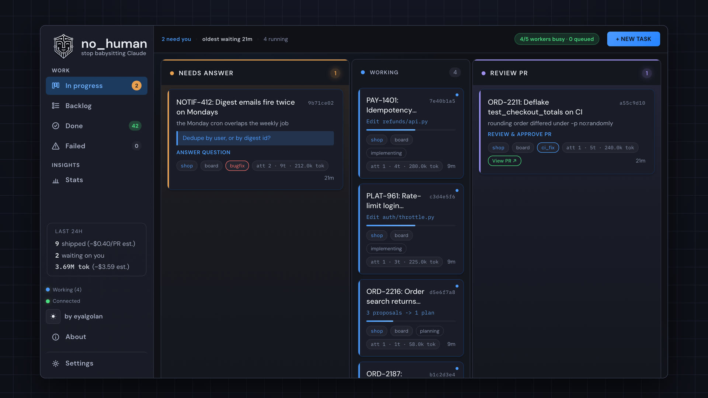

<div align="center">


# no_human

**From ticket to reviewed pull request.**<br>***Free and open-source, on your machine.***

Give it a ticket. Get back a pull request, with the evidence that it works.

[](https://github.com/no-human-ai/no_human/releases/latest) [](https://github.com/no-human-ai/no_human/actions/workflows/ci.yml) [](https://www.python.org/) [](LICENSE)

[getnohuman.com](https://getnohuman.com) · [Quickstart](docs/quickstart.md) · [Docs](docs/README.md) · [Watch it work a sprint](https://getnohuman.com/demo)

[](https://github.com/no-human-ai/no_human/releases/latest) [](https://github.com/no-human-ai/no_human/releases/latest) [](https://github.com/no-human-ai/no_human/releases/latest)

<a href="https://getnohuman.com/"></a>

<sub>▶ <a href="https://getnohuman.com/">Watch the loop</a> — a ticket in, a reviewed pull request out; the whole loop in 57 seconds.</sub>

</div>

Hand it a ticket and walk away. It plans, writes the change, has the work
reviewed by a second model that never saw it being written, runs your tests,
opens the pull request — and stops. You review and merge.

It runs on your machine, against your checkout, on your own Claude credential.
It is not, however, an offline tool: it sends your code to Anthropic as prompts,
and it finishes a task by **pushing your branch to your git host and opening a
pull request** — that is the deliverable, and there is no setting that turns it
off. The coder session also runs with an unrestricted tool set, so it can reach
the network on its own. The full list of what talks to the outside, what you can
switch off, and what you cannot:
[docs/security.md](docs/security.md#7-what-leaves-your-machine).

## Install

Whichever way you install, you need a **Claude credential**: an OAuth token
from `claude setup-token` (personal subscription or enterprise), so install the
Claude Code CLI first — `npm install -g @anthropic-ai/claude-code`, or
`curl -fsSL https://claude.ai/install.sh | bash`. The desktop app also calls
that CLI for every task. To pay Anthropic directly instead, set
`llm.auth_mode: "api_key"` and put your `ANTHROPIC_API_KEY` in
`~/.no_human/.env`.

### Desktop app

Download the build for your platform from the
[latest release](https://github.com/no-human-ai/no_human/releases/latest), open
it, and paste your credential on the **Connect Claude** screen. The app bundles
its own Python, the server and the board — nothing to clone, no `uv sync`.

- **macOS** (Apple silicon) — `no_human-<version>.dmg`, signed and notarized.
  Drag to Applications.
- **Windows** (x64) — `no_human-<version>-UNSIGNED.exe`. Not code-signed yet, so
  SmartScreen warns: choose *More info → Run anyway*. Installs per user, no
  administrator prompt.
- **Linux** (x64) — `no_human-<version>-linux-amd64.deb` (recommended; `sudo apt
  install ./no_human-<version>-linux-amd64.deb`) or the `.AppImage`.

Each release ships a SHA-256 alongside the artifact. Platform notes and the
first-run walk-through: [docs/quickstart.md](docs/quickstart.md).

### From source

```bash
git clone https://github.com/no-human-ai/no_human.git && cd no_human
uv sync                 # installs the `nh` entry point into .venv
(cd web && npm install && npm run build)   # builds the board (cold first install can take minutes)
uv run nh init          # token, config, first repo (about 2 minutes)
uv run nh doctor        # verify the install is real before relying on it
```

The `web` build is not optional if you want the board: a source checkout ships
no `web/dist`, so without it `nh start` serves the API only and renders no UI.
Needs Python 3.12+, [uv](https://github.com/astral-sh/uv), git, and Node with
npm for the board build.

## Run one task

Run `nh` with no arguments for the shell: your lanes, a live event tail, and an
intake you describe a task to in plain English. Every command below still works.

```bash
nh                                   # the shell
nh start                             # board + worker on 127.0.0.1:8420
nh task add https://github.com/org/repo/issues/42 --repo ~/git/repo
nh status                            # needs-you / working / waiting / done
nh review <id>                       # the reviewer's evidence checklist
nh diff <id>                         # the diff it wants to ship
nh approve <id>                      # your approval squash-lands the PR (git.approve_identity)
nh reject <id> --reason "..."        # send it back with feedback
```

## What you get

- **A plan before any code**, from the ticket plus what it finds in your repo.
- **An adversarial review.** A different model, fresh context, read-only tools,
  told to refute "done". You get a pass/fail checklist citing file and line —
  never a numeric self-score.
- **A tamper guard.** Deleted tests, new skips, an assertion turned into a
  tautology — blocked before a reviewer token is spent.
- **Proof the fix fixes something.** For a bug fix, the tests offered as evidence
  must fail at the merge base and pass on the new tree — the reproduction gate
  enforces that, and you can require it for every change.
- **Your tests run**, locally and optionally through your CI.
- **An honest stop.** When it cannot finish, it parks with one specific question
  instead of inventing a plausible diff.

## The agent never merges

Merging is yours. `gh pr merge`, `glab mr merge` and the REST equivalents are
denied to the agent's sessions before they execute, and pushes to
`main`/`master`/`release/*` are refused at the git layer. `nh approve` is
**your** command: it squash-lands the pull request as the operator identity you
configure in `git.approve_identity`; nothing merges without a human running it. Git is driven by no_human's own code under a
distinct commit identity, not by the model; during review the backend is
read-only. Credentials live in `~/.no_human/.env` (`chmod 600`), never in the
repo. Detail: [docs/security.md](docs/security.md).

Every task carries an enforced spend cap. `nh logs <id>` shows real spend
against it, per task.

## Integrations

Point no_human at the tracker you already use and it pulls the tickets to your
board — a tracker's filter lives in your config, never in a task's own text,
and a transport error logs and retries on the next tick instead of crashing
the pool.

| Tracker | How tickets arrive | Filter you configure |
|---|---|---|
| **Jira Cloud** | Polled via REST `search/jql` (HTTP Basic `email:token`) | `integrations.jira.jql` |
| **Linear** | Polled via the GraphQL API | `integrations.linear.team_key` + `state_types` + `label` |
| **monday.com** | Polled via GraphQL v2 | `integrations.monday.board_id` + `status_column` + `todo_labels` |

With write-back on (`write_back`, off by default), the ticket moves with the
task — matched by status category, type, or the label you name, never a
hard-coded transition id — and gets the PR link; a task that needs a human is commented on, never
transitioned. GitHub and
GitLab issues import as tasks by URL, and PRs or MRs open on your own host;
Slack and Teams get a message when a task needs you; Jenkins and CircleCI can
run your test layers and gate the loop. Setup for each:
[docs/adapters.md](docs/adapters.md).

**Watch the Jira flow end to end** — tickets synced from a Jira board, scoped,
implemented, and delivered as a review-passed pull request (click for the full
video with every step):

[](https://getnohuman.com/assets/demo-jira.mp4)

<p align="center">▶️&nbsp;&nbsp;<strong><a href="https://getnohuman.com/assets/demo-jira.mp4">Play the full demo</a></strong> — 1:33, from Jira board to review-passed PR</p>

## Docs

| | |
|---|---|
| [quickstart.md](docs/quickstart.md) | Zero to first task, per platform |
| [configuration.md](docs/configuration.md) | Every setting and default |
| [verification.md](docs/verification.md) | The gates, the bounded loop, the limits |
| [security.md](docs/security.md) | Auth boundary, the never-merge rule, guards |
| [blockers.md](docs/blockers.md) | Escalation, wake watcher, `nh reply` |
| [adapters.md](docs/adapters.md) | Intake, context, VCS and CI backends |
| [eval.md](docs/eval.md) | Golden set, replay scoring, shadow mode |
| [CHANGELOG.md](CHANGELOG.md) | What changed, per release |

## Development

```bash
uv sync
uv run pytest -q
uv run nh --help
```

Issues and pull requests welcome; run `uv run pytest -q` before submitting.

## License

MIT — see [LICENSE](LICENSE). The licence covers the code, not the name:
[TRADEMARK.md](TRADEMARK.md) is the policy on using "no_human" and the logo.
Packaging a binary carries obligations the source tree does not, listed in
[THIRD-PARTY-NOTICES.md](THIRD-PARTY-NOTICES.md).
